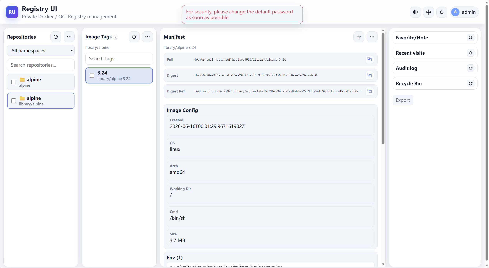

# Registry UI

A lightweight web interface for managing Docker Distribution / OCI Registry images. Designed as a minimal alternative to Harbor with extremely low resource usage.

- Single static binary with embedded web UI
- SQLite persistence (no external database)
- Same host/port for both web UI and Docker CLI (`docker login/pull/push`)
- Reverse proxy to Registry V2 API
- Tag policies, retention, recycle bin, audit logs, RBAC

[中文文档](docs/README.zh.md) | [API Reference](docs/API.md)

## Features

- **Lightweight**: Pure Go single binary, no Node.js/Nginx/Caddy runtime dependencies
- **Unified endpoint**: Web UI and Docker CLI share the same host:port
- **SQLite storage**: Pure Go driver (`modernc.org/sqlite`), no CGO required
- **Tag policies**: Protection modes (overwrite/immutable/rules), overwrite actions (recycle/keep), retention count
- **Recycle bin**: Snapshots manifest before deletion, restorable before GC
- **Garbage collection**: Manual/auto GC with push blocking during operation
- **RBAC**: Namespace-based permissions for non-admin users
- **Audit logs**: Track pull/push/delete/login/user-management actions
- **Immutable tag rules**: Glob patterns to prevent overwriting production tags
- **Webhooks**: Push/delete/untag/restore event notifications
- **API tokens**: Bearer token authentication for API clients
- **I18n**: Chinese and English UI
- **HTTPS**: TLS managed from the UI — toggle on, upload a certificate + key, restart to apply
- **OCI artifacts**: Supports Helm charts, SBOMs, and other OCI artifacts (not just Docker images)



### Registry Version Compatibility

The default setup uses `registry:3` (Docker Distribution v3). It is also fully compatible with `registry:2` (v2.7+ / v2.8+). To switch to `registry:2`, change the image tag in `docker-compose.yml`:

```yaml
services:
  registry:
    image: registry:2
```

No other changes are required — the UI communicates via the standard Registry V2 / OCI Distribution API.

## Quick Start

### Docker Hub (Pre-built Image)

Pull the latest multi-arch image (linux/amd64, linux/arm64):

```bash
# AIO mode (UI + Registry in one container)
docker run -d -p 8080:8080 \
  -e AUTH_MODE=basic \
  -e V2_AUTH_MODE=ui \
  -e ENABLE_DELETE=true \
  -v ./data:/data \
  neuf/registry-ui-go:latest

# Or use docker-compose with pre-built image:
# Replace 'build:' with 'image: neuf/registry-ui-go:latest' in docker-compose.aio.yml
```

See [available tags](https://hub.docker.com/r/neuf/registry-ui-go/tags).

### Docker Compose (Build from Source)

UI and Registry run in separate containers:

```bash
docker compose up -d --build
```

Access: http://localhost:8080

Default credentials: `admin` / `change-me` (must change password on first login)

### All-in-One

Single container with both UI and Registry:

```bash
docker compose -f docker-compose.aio.yml up -d --build
```

### Docker Run (Existing Registry)

```bash
docker build -t registry-ui .
docker run -d -p 8080:8080 \
  -e REGISTRY_URL=http://your-registry:5000 \
  -e AUTH_MODE=basic \
  -e V2_AUTH_MODE=ui \
  -v ./data:/data \
  registry-ui
```

### Local Development

```bash
cp .env.example .env
# Edit REGISTRY_URL and other settings
export $(grep -v '^#' .env | xargs)
go run ./backend/cmd/registry-ui
```

## Configuration

All configuration via environment variables:

| Variable | Default | Description |
|---|---|---|
| `SERVER_ADDR` | `:8080` | Server listen address |
| `AUTH_MODE` | `off` | `off` or `basic` (enable login) |
| `V2_AUTH_MODE` | `registry` | `/v2/` auth: `ui`/`registry`/`off` |
| `REGISTRY_URL` | - | Registry address, e.g. `http://registry:5000` |
| `REGISTRY_USERNAME` | - | Registry basic auth username |
| `REGISTRY_PASSWORD` | - | Registry basic auth password |
| `REGISTRY_TLS_SKIP_VERIFY` | `false` | Skip registry TLS verification |
| `ENABLE_DELETE` | `true` | Allow manifest deletion |
| `ALLOW_WEBHOOK_PRIVATE_IP` | `false` | Allow webhooks to private IPs |
| `DATA_DIR` | `./data` | Persistent data root directory |

### Data Directory Layout

```
data/
├── db/registry-ui.db    # SQLite: settings, users, audit, recycle bin
├── certs/               # TLS certificates
├── uploads/             # Logo, avatars
└── registry/            # Registry storage (AIO/dual compose)
```

## Usage

### Docker CLI

```bash
docker login localhost:8080
docker pull localhost:8080/library/nginx:latest
docker push localhost:8080/library/nginx:latest
```

### Helm Charts (OCI)

```bash
# Login (same credentials as docker login)
helm registry login localhost:8080 --username admin --password change-me --insecure

# Package and push
helm create mychart
helm package mychart/
helm push mychart-0.1.0.tgz oci://localhost:8080/library --plain-http

# Pull
helm pull oci://localhost:8080/library/mychart --version 0.1.0
```

> **Note**: `helm push` requires `--plain-http` for HTTP registries (Helm 3.13+).

### Web UI

- **Repositories**: Browse by namespace, search, multi-select
- **Tags**: View tag list, manifest details, multi-arch info, config
- **Pull commands**: Automatically shows `docker pull` for images and `helm pull` for Helm charts
- **Tag Policies**: Per-repo settings for protection mode, overwrite action, retention, anonymous pull
- **Retention**: Preview and cleanup old images by count (grouped by digest)
- **Recycle Bin**: Restore deleted tags before GC
- **Settings**: Theme, language, page size, GC days, global policies
- **Admin**: User management, permissions, immutable rules, webhooks, API tokens

### Tag Protection Modes

| Mode | Behavior |
|---|---|
| `overwrite` | Allow push to overwrite existing tags |
| `immutable` | All tags are protected from overwrite |
| `rules` (default) | Only tags matching immutable rules are protected |

### Overwrite Actions

When protection mode is `overwrite`:

| Action | Behavior |
|---|---|
| `recycle` (default) | Old manifest goes to recycle bin before being overwritten |
| `keep` | Keep old manifest as untagged image |

## Security

- **Protocol-adaptive secure cookies**: `Secure` flag only when HTTPS is detected
- **CSRF protection**: Required for all state-changing API requests
- **Password hashing**: bcrypt with automatic upgrade from legacy SHA256
- **Session management**: 7-day TTL with background cleanup
- **SSRF protection**: Webhooks blocked from loopback/private IPs by default
- **Security headers**: CSP, HSTS (HTTPS), nosniff, frame deny
- **Namespace RBAC**: Non-admin users only see permitted repositories

### HTTPS / TLS

TLS is managed entirely from **Settings → HTTPS / TLS** (admin only):

1. Toggle **Enable HTTPS** on.
2. Click **Upload certificate** and paste (or choose files for) the certificate
   and private key in PEM format. The pair is validated and stored under
   `CERT_DIR` (`cert.pem` `0644`, `key.pem` `0600`); the key is never served
   over HTTP. TLS uses a TLS 1.2 minimum.
3. **Restart the service** to apply (HTTP↔HTTPS cannot hot-swap on one port).

For a self-signed certificate, make the Docker client trust it (no
`daemon.json` change, per-registry only):

```bash
sudo mkdir -p /etc/docker/certs.d/<host>:<port>
sudo cp cert.pem /etc/docker/certs.d/<host>:<port>/ca.crt
```

Alternatively add the host to `insecure-registries` in `daemon.json` (skips
verification — equivalent to plain HTTP security) and restart Docker.

#### Internal UI↔registry link stays HTTP (this is fine)

In the two-container Compose setup the `registry` service has **no published
ports**; the UI reaches it over `http://registry:5000` on Docker's internal
network. When you enable HTTPS, only the public UI port (`8080`) is encrypted —
the UI↔registry hop never leaves the Docker bridge, so plain HTTP there is
expected and matches the upstream "registry behind a proxy" pattern.

> Do **not** add `ports: 5000:5000` to the `registry` service. That would expose
> an unauthenticated, plaintext registry on the host, bypassing the UI's auth.
> Only give the internal link TLS if the UI and registry run on **separate
> hosts** across an untrusted network.

#### Behind an external reverse proxy (Nginx)

Leave HTTPS **off** in the UI (so it serves plain HTTP) and let Nginx terminate
TLS. Bind the UI to loopback so only the proxy can reach it:

```yaml
# docker-compose.yml
ports:
  - "127.0.0.1:8080:8080"
```

```nginx
server {
    listen 443 ssl http2;
    server_name registry.example.com;

    ssl_certificate     /etc/nginx/certs/fullchain.pem;
    ssl_certificate_key /etc/nginx/certs/privkey.pem;
    ssl_protocols       TLSv1.2 TLSv1.3;

    client_max_body_size 0;   # allow large image layer pushes

    location / {
        proxy_pass http://127.0.0.1:8080;

        proxy_set_header Host              $host;
        proxy_set_header X-Real-IP         $remote_addr;
        proxy_set_header X-Forwarded-For   $proxy_add_x_forwarded_for;
        proxy_set_header X-Forwarded-Proto $scheme;   # required for Secure cookies

        proxy_request_buffering off;   # stream large layers
        proxy_buffering         off;
        proxy_read_timeout      900s;
    }
}

server {
    listen 80;
    server_name registry.example.com;
    return 301 https://$host$request_uri;
}
```

`X-Forwarded-Proto` is **required**: TLS is terminated at Nginx, so the UI only
sees plain HTTP and relies on this header to mark session cookies `Secure`.
`client_max_body_size 0` and disabled buffering prevent `413`/timeout errors on
large layer pushes.

## Development

```bash
# Build
go build -o bin/registry-ui ./backend/cmd/registry-ui

# Test
go test ./...

# Build static binary for Alpine
CGO_ENABLED=0 GOOS=linux GOARCH=amd64 go build -o bin/registry-ui ./backend/cmd/registry-ui
```

## License

Apache 2.0 - See [LICENSE](LICENSE)
